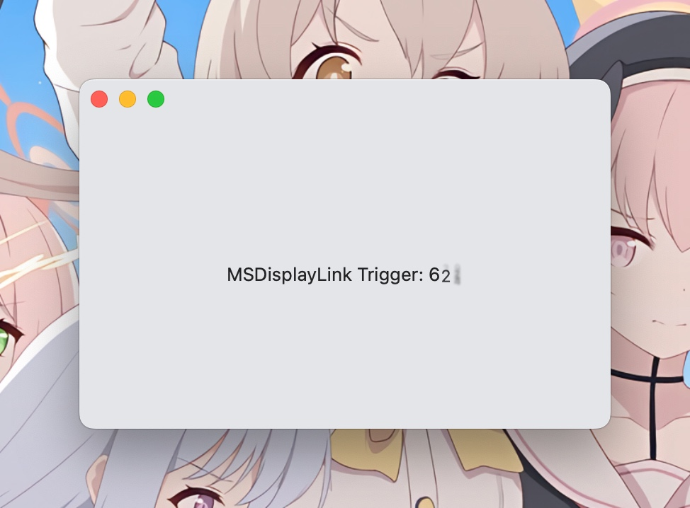

# MSDisplayLink

The missing DisplayLink driver for Apple platforms. Use CADisplayLink on UIKit and CVDisplayLink on AppKit.

Battle tested in [ColorfulX](https://github.com/Lakr233/ColorfulX)

Called MS but it has nothing to do with Microsoft. :P

## Preview



## Installation

### Swift Package Manager

```swift
.package(url: "https://github.com/Lakr233/MSDisplayLink.git", from: "1.0.0")
```

### CocoaPods

**Never thought about it.**

## Usage

### UIKit/AppKit

- Hold reference to `DisplayLink` object.
- Confirm to `DisplayLinkDelegate` protocol to get called within `synchronization()`.
- Call `displayLink.delegatingObject` with a `DisplayLinkDelegate` object.

### SwiftUI

```
import MSDisplayLink
import SwiftUI

struct ContentView: View {
    @State var frame: Int = 0
    var body: some View {
        VStack {
            Text("MSDisplayLink Trigger: \(frame)")
                .monospacedDigit()
                .contentTransition(.numericText())
        }
        .animation(.interactiveSpring, value: frame)
        .modifier(DisplayLinkModifier(scheduleToMainThread: true) {
            frame += 1
        })
        .padding()
    }
}
```

## License

[MIT License](LICENSE)

---

2024.08.14
