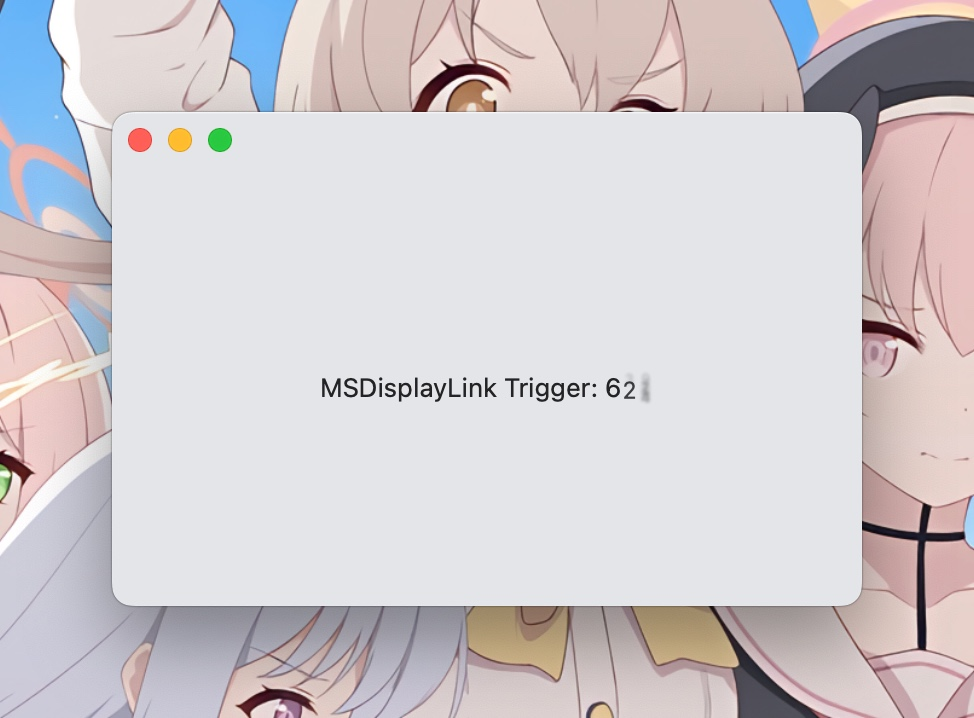

# MSDisplayLink

The missing DisplayLink driver for Apple platforms. Use CADisplayLink on UIKit and CVDisplayLink on AppKit.

Battle tested in [ColorfulX](https://github.com/Lakr233/ColorfulX)

Called MS but it has nothing to do with Microsoft. :P

## Preview



## Installation

### Swift Package Manager

```swift
.package(url: "https://github.com/Lakr233/MSDisplayLink.git", from: "2.0.8")
```

### CocoaPods

**Never thought about it.**

## Usage

### UIKit/AppKit

Follow the steps to get called. The `DisplayLinkDelegate` is friendly to confirm for a UIView or NSView.

- Hold reference to `DisplayLink` object.
- Confirm to `DisplayLinkDelegate` protocol to get called within `synchronization()`.
- Call `displayLink.delegatingObject` with a `DisplayLinkDelegate` object.

Tech Tips:

- Call to `synchronization()` is performed at a background thread.
- The link asks the display for full ProMotion by default (60–120 fps,
  preferred 120). Tune it per instance with
  `DisplayLink(preferredFrameRateRange:)` or the `preferredFrameRateRange`
  property — all live instances share one platform link, and the applied
  range is the union of every instance's request. On iPhone the host app
  must also set `CADisableMinimumFrameDurationOnPhone` in its Info.plist,
  or the system clamps everything to 60. The CVDisplayLink path (AppKit)
  always runs at the display's own rate and ignores the request.
- Scheduler is a serial queue unique to each `DisplayLinkDriver` holds by `DisplayLink`.
    - Queue inherits the quality of service from the where you created the `DisplayLink`.
    - Does not make scene to use concurrent queue.
    - Does not share the queue across different `DisplayLink` objects.
    - Queue names are same.

### SwiftUI

```
import MSDisplayLink
import SwiftUI

struct ContentView: View {
    @State var frame: Int = 0
    var body: some View {
        VStack {
            Text("MSDisplayLink Trigger: \(frame)")
                .monospacedDigit()
                .contentTransition(.numericText())
        }
        .animation(.interactiveSpring, value: frame)
        .modifier(DisplayLinkModifier(scheduleToMainThread: true) {
            frame += 1
        })
        .padding()
    }
}
```

## License

[MIT License](LICENSE)

---

2024.08.14
