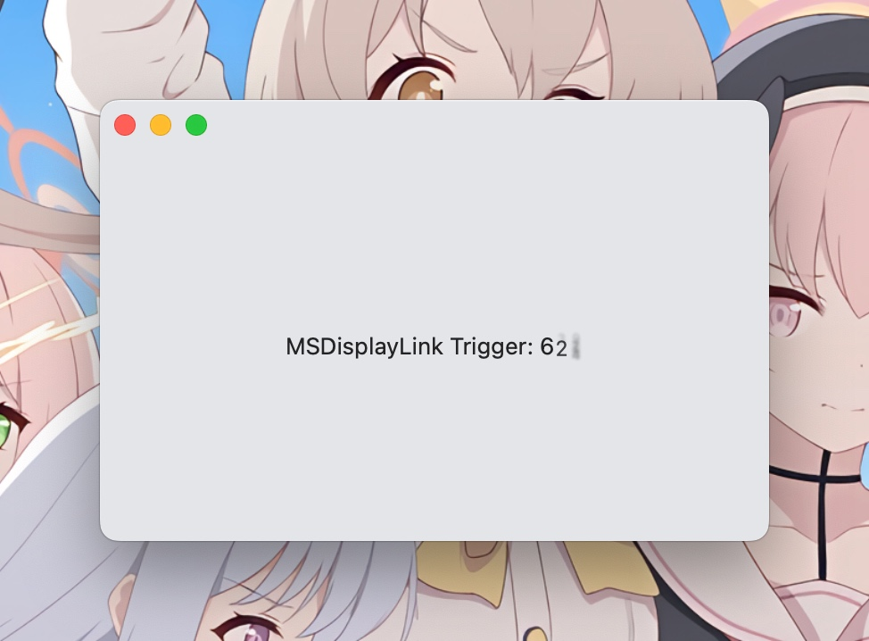

# DisplayLink

The missing display link for Apple platforms: one API over `CADisplayLink` on UIKit and `CVDisplayLink` on AppKit, bound to the display that actually shows your view.

Battle tested in [ColorfulX](https://github.com/Lakr233/ColorfulX).

Formerly MSDisplayLink. 2.x stays available at the old URL; see [Migrating from 2.x](#migrating-from-2x).

## Preview



## Installation

### Swift Package Manager

```swift
.package(url: "https://github.com/Lakr233/DisplayLink.git", from: "3.0.0")
```

Supports iOS 15, macOS 12, Mac Catalyst 15, tvOS 15 and visionOS 1, the oldest systems current toolchains deploy to. Requires Swift 6.2 (Xcode 26) or later.

## Usage

### UIKit / AppKit

Bind the link to the view you draw into, and become its delegate:

```swift
import DisplayLink

final class CanvasView: UIView, DisplayLinkDelegate {
    private lazy var link = DisplayLink(context: .view(self))

    override init(frame: CGRect) {
        super.init(frame: frame)
        link.delegate = self
    }

    func displayLink(_ displayLink: DisplayLink, didUpdate frame: DisplayLinkFrame) {
        // Runs on the main thread, once per refresh of the display showing this view.
        // Finish before frame.targetTimestamp; step animations by frame.duration.
    }
}
```

- `DisplayLink` and its delegate are main-actor bound; frames always arrive on the main thread.
- The delegate is held weakly, so the link's owner can be its delegate.
- `isPaused` stops a link without releasing it.

### Contexts

| Context | Ticks with |
|---|---|
| `.main` (default) | The primary display |
| `.view(view)` | The display showing `view`. Quiet while the view is not in a window; follows the window to another display. The view is held weakly |
| `.screen(screen)` | That screen, while it is connected (not on visionOS) |

`context` can be changed at any time, so an object that gets its view later can start on `.main` and rebind.

A `.view` link adds one hidden, zero-size subview to the view so it hears about the view entering and leaving windows. It takes no input and is invisible to accessibility.

### Async sequence

```swift
for await frame in link.frames {
    // A moment after the refresh, rather than inside it.
}
```

Each access to `frames` starts a new sequence. It buffers only the newest frame, so a consumer that falls behind skips frames instead of queuing them, and it finishes when the link is released. Work that must land in the current frame belongs in the delegate.

### SwiftUI

```swift
import DisplayLink
import SwiftUI

struct ContentView: View {
    @State var frame: Int = 0
    var body: some View {
        Text("DisplayLink Trigger: \(frame)")
            .onDisplayLink { _ in
                frame += 1
            }
    }
}
```

`onDisplayLink(preferredFrameRateRange:isPaused:perform:)` binds to the window hosting the view: it ticks while the view is on screen and stops when it leaves, however often the view re-renders.

## Scheduling rules

- **Frame rate.** `preferredFrameRateRange` defaults to full ProMotion (60–120, preferred 120). On iPhone, rates above 60 also need `CADisableMinimumFrameDurationOnPhone` in the app's Info.plist. Ranges Core Animation would reject are normalized first: the maximum is a cap, and `preferred: 0` means no preference.
- **Sharing.** Links asking for the same rate on the same display share one system link. A different rate gets its own system link, so a link asking for 30 receives 30 frames a second, each lasting a 30th of a second, while others on the same display run at 120. CVDisplayLink cannot be slowed, so on macOS frames are skipped down to the preferred rate.
- **Order.** Links on one system link are called in the order they were created, however often they pause, resume or rebind in between. Links at different rates tick on their own schedules.
- **Cost.** A link that is paused, unbound or in a backgrounded app holds no system link. Display changes are followed through system notifications plus a once-a-second check; nothing is resolved per frame.

### Lists and table cells

Bind a cell's link to the cell (or its content view). A reused cell waiting off screen is out of the window, so its link costs nothing until the cell is shown again; only the visible cells tick. For many cells animating together, consider one link on the list that drives the visible cells instead.

## Migrating from 2.x

| 2.x (`import MSDisplayLink`) | 3.0 (`import DisplayLink`) |
|---|---|
| `.package(url: ".../MSDisplayLink.git", from: "2.x")` | `.package(url: ".../DisplayLink.git", from: "3.0.0")` |
| `DisplayLink()` then `delegatingObject(object)` | `DisplayLink(context: .view(view))` then `delegate = object` |
| `func synchronization(context: DisplayLinkCallbackContext)` | `func displayLink(_:didUpdate frame: DisplayLinkFrame)`, on the main actor |
| `context.duration`, `context.timestamp`, `context.targetTimestamp` | `frame.duration`, `frame.timestamp`, `frame.targetTimestamp` |
| `.modifier(DisplayLinkModifier { ... })` | `.onDisplayLink { frame in ... }` |
| `scheduleToMainThread: false` | Removed; hop to another queue from the callback if needed |
| Ranges combined into one shared rate | One system link per display and rate |
| iOS 13, macOS 11, Mac Catalyst 13, tvOS 13; Swift 6.0 | iOS 15, macOS 12, Mac Catalyst 15, tvOS 15; Swift 6.2 |

The old URL redirects here, and 2.x releases remain installable from it. Depend on the new URL for 3.x: a graph that reaches 3.x through both URLs would declare the `DisplayLink` module twice.

## License

[MIT License](LICENSE)

---

2024.08.14
